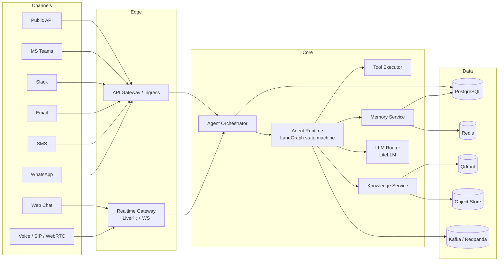

# Vertical AI Agent Platform

> Enterprise-grade platform for building AI Employees that talk, chat, and act across **Voice, Web, WhatsApp, SMS, Email, Slack, MS Teams, and API** — powered by a single, channel-agnostic conversation engine.

---

## What This Is

A **Vertical AI Agent Platform** — not a voice bot, not a chatbot builder. It is the underlying operating system for domain-specialized AI Employees that businesses can configure, deploy, and scale across every customer-facing surface.

Think: **Retell + Vapi + Bland (voice) ∪ Intercom Fin (chat) ∪ Rasa/LangGraph (orchestration) ∪ Twilio (channels)** — unified into one enterprise-grade, multi-tenant, observable, secure platform.

### Verticals Supported (Day 1 → Day 365)

Customer Support · Sales SDR · Restaurant Ordering · Medical Reception · Real Estate · HR Interviewing · Appointment Booking · Loan Collection · Insurance Intake · Manufacturing Ops · Legal Intake · Finance/Banking

---

## Core Principles

| Principle | What It Means Here |
|-----------|-------------------|
| Channel-agnostic | One `AgentRuntime`, N transports |
| Async-first | Everything streams; nothing blocks |
| Multi-tenant by default | Row-level isolation, per-tenant limits, per-tenant vaults |
| Observability-first | Every turn is a distributed trace |
| Security-first | SOC2 / HIPAA / GDPR / PCI-adjacent from Day 1 architecture |
| Cloud-agnostic | K8s + open standards; no lock-in |
| Plugin architecture | Tools, LLMs, TTS, STT, channels are all pluggable |
| Testing-first | Deterministic replay of every conversation |

---

## Local Development

**Prerequisites:** Python 3.12, Node 22, [uv](https://docs.astral.sh/uv/), [pnpm](https://pnpm.io/) 9, Docker (for Postgres/Redis/Mailpit), and GNU Make (optional convenience wrapper).

```bash
git clone https://github.com/lovekumar8884/vertical-ai-agent-platform.git
cd vertical-ai-agent-platform
cp .env.example .env        # then fill in the required keys
make install                # uv sync + pnpm install
make dev                    # start Postgres, Redis, Mailpit
make dev-api                # (separate terminal) FastAPI on :8000
make dev-console            # (separate terminal) Next.js on :3000
```

Without Make, run the underlying commands directly (`docker compose up -d`, `uv run uvicorn ...`, `pnpm dev`). See the [Makefile](Makefile) for the full target list (`make help`).

The Sprint 1 goal: sign up → organization → Demo Agent → Test Chat → streamed `gpt-4o-mini` response → history. Scope is frozen in [ARCHITECTURE_FREEZE_V1.md](ARCHITECTURE_FREEZE_V1.md) and [SPRINT1_FINAL_SCOPE.md](SPRINT1_FINAL_SCOPE.md).

---

## Documentation Map

Read in this order:

1. [PROJECT_VISION.md](docs/PROJECT_VISION.md) — Why this exists, who it serves
2. [PRODUCT_REQUIREMENTS.md](docs/PRODUCT_REQUIREMENTS.md) — What we build (functional + NFR)
3. [SYSTEM_ARCHITECTURE.md](docs/SYSTEM_ARCHITECTURE.md) — The 30,000-ft view
4. [MICROSERVICE_ARCHITECTURE.md](docs/MICROSERVICE_ARCHITECTURE.md) — Service boundaries
5. [DATABASE_DESIGN.md](docs/DATABASE_DESIGN.md) — Data model
6. [API_DESIGN.md](docs/API_DESIGN.md) — REST, WebSocket, Webhooks, SDKs
7. [AUTHENTICATION.md](docs/AUTHENTICATION.md) — AuthN/AuthZ, keys, SSO
8. [MULTI_TENANCY.md](docs/MULTI_TENANCY.md) — Isolation model
9. [AGENT_ENGINE.md](docs/AGENT_ENGINE.md) — The conversation brain
10. [VOICE_PIPELINE.md](docs/VOICE_PIPELINE.md) — STT → LLM → TTS realtime path
11. [MEMORY_SYSTEM.md](docs/MEMORY_SYSTEM.md) — Short/long/episodic memory
12. [KNOWLEDGE_BASE.md](docs/KNOWLEDGE_BASE.md) — RAG pipeline
13. [TOOL_CALLING.md](docs/TOOL_CALLING.md) — Function calling framework
14. [OBSERVABILITY.md](docs/OBSERVABILITY.md) — Traces, metrics, logs, evals
15. [SECURITY.md](docs/SECURITY.md) — Threat model, compliance
16. [SCALING.md](docs/SCALING.md) — From 10 → 10M conversations
17. [DEPLOYMENT.md](docs/DEPLOYMENT.md) — K8s, regions, CI/CD
18. [TECH_STACK.md](docs/TECH_STACK.md) — Every tech decision, justified
19. [ROADMAP.md](docs/ROADMAP.md) — MVP → Enterprise
20. [TASK_BREAKDOWN.md](docs/TASK_BREAKDOWN.md) — Sprint-ready workstreams
21. [CODING_STANDARDS.md](docs/CODING_STANDARDS.md) — How we write code
22. [TESTING_STRATEGY.md](docs/TESTING_STRATEGY.md) — Unit → Eval → Load
23. [COST_ESTIMATION.md](docs/COST_ESTIMATION.md) — Unit economics

---

## High-Level Architecture (One Diagram)



---

## Repository Layout (Target)

```
verticalsasai/
├── docs/                    # This documentation set
├── services/
│   ├── gateway/             # API + WS ingress (FastAPI)
│   ├── realtime/            # Voice/WebRTC (LiveKit agents + Pipecat)
│   ├── orchestrator/        # Session lifecycle, routing
│   ├── agent-runtime/       # LangGraph-based conversation engine
│   ├── tool-executor/       # Sandboxed function calls
│   ├── memory/              # Short/long-term memory
│   ├── knowledge/           # RAG indexing + retrieval
│   ├── llm-router/          # LiteLLM proxy + policy
│   ├── channels/            # WhatsApp/SMS/Email/Slack/Teams adapters
│   ├── billing/             # Usage metering
│   ├── analytics/           # Eval + reporting
│   └── admin/               # Tenant, user, RBAC
├── packages/
│   ├── proto/               # gRPC / OpenAPI schemas
│   ├── sdk-python/
│   ├── sdk-node/
│   └── shared/              # Common libs
├── apps/
│   ├── console/             # Next.js admin console
│   ├── widget/              # Embeddable web chat widget
│   └── docs-site/           # Public docs
├── infra/
│   ├── helm/                # Helm charts
│   ├── terraform/           # Cloud infra
│   └── k8s/                 # Manifests
└── tests/
    ├── e2e/
    ├── load/                # k6, Locust
    └── evals/               # LLM eval harness
```

---

## Status

**Phase 0 — Architecture & Blueprint** (this document set).
No application code exists yet by design. Implementation follows [ROADMAP.md](docs/ROADMAP.md).

---

## License

TBD (Business Source License 1.1 recommended for infra components; commercial for platform).
