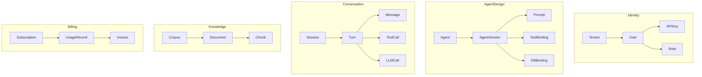

# MICROSERVICE ARCHITECTURE

## 1. Service Decomposition Principle

We split a service **only when** at least one of the following is true:
- Different **scaling profile** (voice realtime ≠ email batch).
- Different **failure domain** (billing outage must not stop conversations).
- Different **release cadence** (channel adapters change weekly; billing quarterly).
- Different **compliance** boundary (PII vault vs. analytics).
- Different **team ownership**.

Everything else stays a **modular monolith inside a service** (packages, not services).

## 2. Service Catalog

| # | Service | Responsibility | Sync API | Async | Persistence | Scale Dim |
|---|---------|---------------|---------|-------|-------------|-----------|
| 1 | **gateway** | AuthN, rate limit, routing, request signing | HTTPS/gRPC | — | Redis (limits) | RPS |
| 2 | **realtime-gateway** | WebRTC/SIP media, VAD, STT/TTS bridging | WSS, SIP, WebRTC | — | Redis | Concurrent calls |
| 3 | **orchestrator** | Session lifecycle, channel routing, handoff | gRPC | Kafka pub/sub | Postgres, Redis | Active sessions |
| 4 | **agent-runtime** | LangGraph state machine, prompt assembly, tool dispatch | gRPC | Kafka | Redis (state) | Concurrent turns |
| 5 | **llm-router** | Model routing, fallback, caching, quota | HTTP (OpenAI-compat) | — | Redis | Tokens/s |
| 6 | **tool-executor** | Sandboxed function calls, connectors | gRPC | Kafka | Postgres (audit) | Tool ops/s |
| 7 | **memory** | Short/long/episodic memory | gRPC | Kafka consume | Redis + Postgres + Qdrant | Sessions |
| 8 | **knowledge** | Ingest, chunk, embed, retrieve (RAG) | gRPC | Temporal workflows | Qdrant + Postgres + S3 | Docs/QPS |
| 9 | **channels-\*** | Adapter per channel (WA, SMS, Email, Slack, Teams) | HTTP (webhooks in) | Kafka | Postgres | Messages/s |
| 10 | **billing** | Metering, invoicing, quotas | gRPC | Kafka consume | Postgres | Events/s |
| 11 | **analytics** | Trace/turn ingest, dashboards, evals | gRPC | Kafka consume | ClickHouse | Events/s |
| 12 | **eval** | Golden set runs, LLM-judge, regression | HTTP | Temporal | Postgres + S3 | Jobs/hr |
| 13 | **admin/iam** | Tenants, users, RBAC, keys, audit | HTTP/gRPC | Kafka pub | Postgres | Users |
| 14 | **notifier** | Email/SMS/Slack for platform events | gRPC | Kafka consume | — | Notifs/s |
| 15 | **connector-mgr** | OAuth flows, credential vault, per-tenant secrets | HTTP | — | Vault + Postgres | Connections |

## 3. Bounded Contexts (DDD)

## 4. Inter-Service Communication

- **Sync**: gRPC (Protobuf, HTTP/2) inside cluster; REST/JSON at public edge.
- **Async**: Kafka (Redpanda in single-cluster envs) with schema registry (Protobuf via Buf Schema Registry).
- **Workflows**: Temporal for anything > 1 s or needing retries/compensation (KB ingestion, outbound campaigns, human handoff SLAs, billing runs).
- **Realtime media**: WebRTC via LiveKit; SIP via LiveKit SIP or FreeSWITCH bridge.
- **Service discovery**: Kubernetes DNS + Istio/Linkerd (mTLS between services).

## 5. Contract Design

- Every service owns its `.proto` files under `packages/proto/<service>/v1/`.
- **Backward compatibility mandatory** — Buf lint + breaking change detection in CI.
- Public APIs (REST) generated from OpenAPI 3.1 spec; SDKs auto-generated (openapi-generator).
- Events: versioned topics `<domain>.<entity>.<verb>.v<n>` (e.g., `conversation.turn.completed.v1`).

## 6. Data Ownership

**Golden rule: one service owns each table.** Other services access via API or subscribe to events.

| Owner | Owns |
|-------|------|
| admin | tenants, users, roles, api_keys, audit_log |
| orchestrator | sessions, session_participants |
| agent-runtime | (stateless; state in Redis + Postgres via memory service) |
| memory | short_term (Redis), long_term_facts (Postgres), episodic (Qdrant) |
| knowledge | corpora, documents, chunks (Postgres+Qdrant+S3) |
| tool-executor | tool_definitions, tool_call_log |
| channels-* | channel_accounts, channel_messages |
| billing | subscriptions, usage_records, invoices |
| analytics | (read-only projections in ClickHouse) |
| connector-mgr | connections, credentials (Vault refs) |

Cross-service reads use **API composition** or **materialized projections** (never cross-DB joins).

## 7. Deployment Unit

Each service ships as:
- OCI image (multi-arch amd64/arm64)
- Helm chart (with values overlays per env)
- SBOM + Cosign signature
- OpenAPI/proto artifact published to schema registry

## 8. Anti-Patterns We Reject

- ❌ Shared database across services
- ❌ Distributed monolith (chatty sync calls between micros)
- ❌ Event bus as RPC (no request/reply over Kafka)
- ❌ Service-per-endpoint (nano-services)
- ❌ Skipping schema registry ("we'll add it later")

## 9. Service Template Standard

Every new service must include:
- Health/readiness endpoints (`/healthz`, `/readyz`)
- OpenTelemetry auto-instrumentation
- Structured logs (JSON, correlation IDs)
- Prometheus metrics (`/metrics` on separate port)
- Graceful shutdown (SIGTERM → drain 30s)
- Migration tool (Alembic/Flyway) baked into image
- `Makefile`: `dev`, `test`, `lint`, `build`, `run`, `proto`

## 10. Assumptions

- Team size supports 8–12 owning teams within 18 months; before that, several services co-owned.
- We accept Istio/Linkerd operational cost for mTLS + policy; managed alternatives (Linkerd) preferred.
- Temporal chosen over Airflow/Kafka Streams for durable workflows — worth the operational cost.
