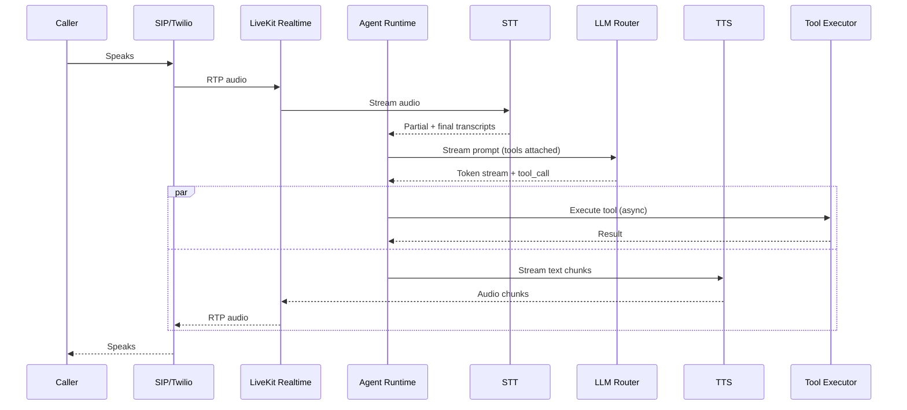

# SYSTEM ARCHITECTURE

## 1. Architectural Style

- **Hexagonal core** (agent runtime) with **event-driven** integrations.
- **Microservices** at bounded contexts where scaling profiles differ (voice ≠ email ≠ billing).
- **Modular monolith allowed** inside each service until scale forces split.
- **Async-first** — Kafka/NATS backbone; sync only at edge (HTTP/gRPC).
- **CQRS** only in Analytics and Conversation Search (justified by read/write asymmetry).
- **Saga** pattern for cross-service workflows (via Temporal).

## 2. Layered View

```
┌─────────────────────────────────────────────────────────────┐
│  Channels: Voice · Web · WhatsApp · SMS · Email · Slack ·   │
│            Teams · Public API                                │
├─────────────────────────────────────────────────────────────┤
│  Edge Layer                                                  │
│    • API Gateway (Envoy/Kong)      • Realtime Gateway       │
│    • WAF + Rate limit + AuthN      • WebRTC (LiveKit) + SIP │
├─────────────────────────────────────────────────────────────┤
│  Application Services                                        │
│    • Orchestrator     • Agent Runtime   • Tool Executor     │
│    • Memory           • Knowledge (RAG) • LLM Router        │
│    • Channel Adapters • Billing         • Analytics         │
│    • Admin/IAM        • Eval Service    • Notification      │
├─────────────────────────────────────────────────────────────┤
│  Platform Services                                           │
│    • Temporal (workflows)  • Kafka/Redpanda (events)        │
│    • Redis (state, pub/sub)• OpenTelemetry Collector        │
├─────────────────────────────────────────────────────────────┤
│  Data Layer                                                  │
│    • PostgreSQL (OLTP)   • Qdrant (vectors)                 │
│    • ClickHouse (OLAP)   • S3/MinIO (blobs)                 │
│    • Redis (cache)                                          │
└─────────────────────────────────────────────────────────────┘
```

## 3. Request Flows

### 3.1 Voice Turn (happy path)



Latency budget (700 ms p50 turn):

| Stage | Budget |
|-------|--------|
| VAD end-of-speech detection | 120 ms |
| STT finalization | 100 ms |
| LLM first token (via prefix cache) | 250 ms |
| TTS first chunk | 150 ms |
| Network + jitter | 80 ms |

### 3.2 Chat Turn (WhatsApp/Web/SMS/Slack)

```
User → Channel Provider Webhook → API Gateway → Channel Adapter
      → Orchestrator (session lookup) → Agent Runtime
      → LLM Router (+ optional Tool Executor + Memory + KB)
      → Channel Adapter → Provider → User
```

### 3.3 Handoff to Human
- Agent emits `handoff` event → Orchestrator marks session `human` → routes to helpdesk (Zendesk/Intercom/Freshdesk connector) with full transcript + context bundle.

## 4. Component Interaction Matrix

| From \ To | Gateway | Orch | Runtime | Tool | Memory | KB | LLM | Channels |
|-----------|---------|------|---------|------|--------|----|----|----------|
| Gateway   | —       | REST/gRPC | — | — | — | — | — | — |
| Orchestrator | — | — | gRPC | — | Redis | — | — | Kafka |
| Runtime   | — | Kafka events | — | gRPC | gRPC | gRPC | HTTP | — |
| Tool Exec | — | — | Kafka result | — | — | — | — | — |
| Channels  | — | Kafka | — | — | — | — | — | HTTP webhooks out |

## 5. Data Flow Principles

1. **Every conversation turn** produces a signed, immutable event on Kafka topic `conversation.turns.v1`.
2. **Every LLM call** emits a `llm.usage.v1` event (for billing + evals).
3. **Every tool call** emits `tool.executed.v1` with request/response digests.
4. All events flow to:
   - **ClickHouse** (analytics, retention 90d hot / 2y cold)
   - **S3** (long-term audit, WORM bucket for compliance tenants)
   - **OpenTelemetry** (traces linked by `conversation_id` + `turn_id`).

## 6. Failure Domains

| Domain | Blast radius | Mitigation |
|--------|-------------|-----------|
| Single AZ down | 33% region capacity | Multi-AZ K8s, PDBs, `topologySpreadConstraints` |
| Region down | 1 region tenants | Multi-region active/active for control plane; active/passive data plane; DNS failover |
| LLM provider down | Model-specific | LiteLLM fallback chain; circuit breakers |
| Kafka down | Async writes | Local disk buffer (Vector agent) with replay |
| Postgres primary down | Writes | Patroni/RDS HA failover (< 30s) |
| Redis down | Session state | Redis Cluster + persistent snapshot; degrade to Postgres |

## 7. Consistency Model

- **Strong** (Postgres, single-region): tenants, users, agents, billing.
- **Read-your-writes** (Redis + Postgres write-through): active session state.
- **Eventually consistent** (Kafka → ClickHouse, Qdrant, S3): analytics, KB indices.
- **Deterministic replay**: given the same event log + agent version + model+seed, a conversation replays identically (best-effort; LLMs limit this — mitigated by capturing exact model responses).

## 8. Deployment Topology

- **Global control plane** (1 primary region, DR replica): billing, admin, agent versioning, marketplace.
- **Regional data planes** (US-East, US-West, EU-West, IN-South, AP-South): full stack per region; tenants pinned by data residency.
- **Edge PoPs**: WebRTC media (LiveKit) + STT edge nodes in 15+ locations to minimize voice RTT.

## 9. Cross-Cutting Concerns

- **Config**: 12-factor + Helm values + dynamic config via Unleash/OpenFeature.
- **Secrets**: HashiCorp Vault (primary) or cloud KMS+SM; short-lived tokens via Vault Agent.
- **Feature flags**: OpenFeature standard; per-tenant targeting.
- **Idempotency**: All mutating APIs require `Idempotency-Key`; stored in Redis (24h).
- **Rate limits**: Token-bucket per-tenant + per-endpoint at gateway; per-model at LLM Router.

## 10. Assumptions
- We are willing to operate Kubernetes ourselves (or via managed EKS/GKE/AKS).
- We can afford 2–3 regions on Day 1 (US + EU or US + IN).
- Voice traffic will be < 20% of total by count but > 60% by cost — architecture optimized accordingly.
