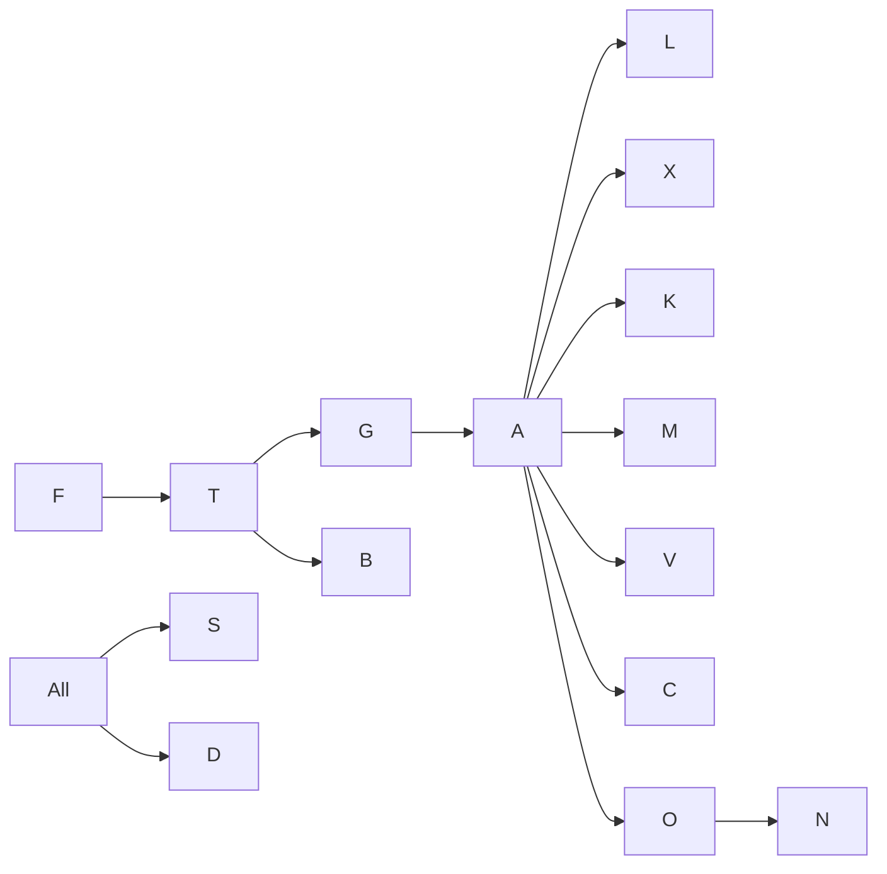

# TASK BREAKDOWN

Sprint-ready workstreams derived from [ROADMAP.md](ROADMAP.md). Each task is scoped to fit within one sprint (~2 weeks). Effort: **S** (< 3 dev-days), **M** (3–8), **L** (8–20).

Format: `[ID] [Owner-role] [Effort] Title — Acceptance`

---

## EPIC 0 — Foundations

- **F-01** [SRE][M] Provision Terraform baseline (VPC, EKS, RDS PG, Redis, S3, Vault) — `terraform apply` yields healthy cluster; kubectl access via SSO.
- **F-02** [SRE][M] Argo CD + ApplicationSet pattern — sample service auto-syncs.
- **F-03** [DevEx][M] Monorepo scaffold (`services/`, `packages/`, `apps/`, `infra/`) + Buf/OpenAPI conventions.
- **F-04** [DevEx][M] `make dev` docker-compose stack (PG, Redis, Qdrant, Redpanda, MinIO, Temporal, LiveKit, Wiremock).
- **F-05** [DevEx][S] Devcontainer definition.
- **F-06** [SRE][M] CI pipeline (GitHub Actions): lint, test, build multi-arch, cosign, SBOM (syft), Trivy scan.
- **F-07** [SRE][M] OpenTelemetry Collector + Grafana/Tempo/Loki/Prometheus deployment.
- **F-08** [BE][M] Service template (FastAPI): health, otel, structured logs, prom metrics, graceful shutdown, migrations.
- **F-09** [BE][M] Service template (Node/Fastify): equivalent.
- **F-10** [Sec][M] Vault install + Vault Agent injector; sealed secrets or ESO chosen.

---

## EPIC 1 — Identity & Tenancy

- **T-01** [BE][L] Admin/IAM service: tenants, users, roles, api_keys tables + REST APIs + audit log.
- **T-02** [BE][M] Postgres RLS setup + `TenantScopedSession` wrapper + lint rule to forbid raw connections.
- **T-03** [BE][M] WorkOS integration: SAML/OIDC/SCIM + tenant provisioning webhook.
- **T-04** [BE][M] API key issuance + Argon2 hashing + prefix format + scoped keys.
- **T-05** [BE][S] Idempotency-Key middleware backed by Redis.
- **T-06** [BE][M] OPA sidecar + baseline policies (`tenant_isolation.rego`, `scope_check.rego`).
- **T-07** [FE][M] Console: login (WorkOS AuthKit), tenant/user/roles pages.
- **T-08** [QA][M] Cross-tenant leakage test harness (auto-run on every PR).

---

## EPIC 2 — Gateway & Contracts

- **G-01** [SRE][M] Envoy/Kong ingress + WAF (Cloudflare) + rate limits per tenant.
- **G-02** [BE][M] Public REST OpenAPI 3.1 spec skeleton + auto-generated SDK (Python, Node).
- **G-03** [BE][M] gRPC scaffolds (Buf) + Istio mTLS + service discovery.
- **G-04** [BE][S] Problem+JSON error handler middleware.
- **G-05** [BE][M] SSE + WebSocket gateway with heartbeat + reconnect.
- **G-06** [BE][S] Webhook signing (HMAC) + delivery service with backoff + DLQ.

---

## EPIC 3 — Agent Runtime

- **A-01** [AI][L] LangGraph-based runtime skeleton with `prompt` node + state persistence (Redis+PG).
- **A-02** [AI][M] `classify` node with structured output.
- **A-03** [AI][M] `slot_fill` node with typed variables + re-ask.
- **A-04** [AI][M] `tool_call` node dispatching to Tool Executor via gRPC.
- **A-05** [AI][M] `rag` node (calls Knowledge service).
- **A-06** [AI][M] `handoff` node (emits event → orchestrator).
- **A-07** [AI][M] Prompt composer with token budgeting + rolling summarization.
- **A-08** [AI][M] Streaming end-to-end (LLM tokens → runtime → gateway → client).
- **A-09** [AI][M] Interruption support (cancel LLM/TTS on user speech).
- **A-10** [AI][M] Deterministic replay from event log.
- **A-11** [AI][S] Agent spec loader (YAML) + versioning + immutable version rows.
- **A-12** [AI][M] Guardrail middleware (input classifier, output validator, PII redactor).

---

## EPIC 4 — LLM Router

- **L-01** [AI][M] Deploy LiteLLM proxy with OpenAI + Anthropic + Groq configured.
- **L-02** [AI][M] Per-tenant budgets + rate limits + fallback chains.
- **L-03** [AI][M] Prompt cache (Redis) + semantic cache (embedding-keyed).
- **L-04** [AI][M] Usage event emission → `llm.usage.v1` topic.
- **L-05** [AI][S] Model registry (per-vertical defaults, per-tenant overrides).

---

## EPIC 5 — Tool Executor

- **X-01** [BE][L] Tool Executor service (gRPC): HTTP kind + auth via Vault connection refs.
- **X-02** [BE][M] JSON Schema validation + coercion + retries + circuit breaker.
- **X-03** [BE][M] OpenAPI importer → tool auto-generation.
- **X-04** [BE][M] Sandboxed custom code runner (Firecracker or gVisor) — Python + Node runtimes.
- **X-05** [BE][M] MCP client integration.
- **X-06** [BE][M] Built-in tools: calendar, email, sms, web_search, web_scrape, db_query, handoff.
- **X-07** [BE][M] Tool call audit log + streaming progress events.

---

## EPIC 6 — Knowledge / RAG

- **K-01** [AI][L] Knowledge service + Temporal ingestion workflow.
- **K-02** [AI][M] Parsers: PDF (Unstructured/Marker), DOCX, HTML (Trafilatura), MD, images (BLIP-2+OCR).
- **K-03** [AI][M] Semantic + recursive chunkers; contextual chunk enrichment (opt-in).
- **K-04** [AI][M] Embedding batch client (OpenAI + BGE-M3 fallback).
- **K-05** [AI][M] Qdrant collections (shared + dedicated) + payload filters + tenant enforcement.
- **K-06** [AI][M] Hybrid retrieval (BM25 via PG tsvector + vector) + RRF + reranker (Cohere / BGE-reranker).
- **K-07** [AI][M] RAG answer node with citation format + grounding check.
- **K-08** [AI][M] Connectors: URL crawler, Google Drive, Notion, Confluence.
- **K-09** [AI][M] Retrieval evals (hit@k, MRR) + Faithfulness LLM judge.

---

## EPIC 7 — Memory

- **M-01** [AI][M] Short-term store (Redis) + rolling summarizer.
- **M-02** [AI][M] Long-term facts table + LLM-extractor async job.
- **M-03** [AI][M] Episodic memory (Qdrant) with tenant isolation.
- **M-04** [AI][S] Memory injection into prompt composer with budgets.
- **M-05** [FE][M] End-user memory drawer in console + "forget me" API.

---

## EPIC 8 — Voice Pipeline

- **V-01** [Voice][L] LiveKit deploy (self-hosted) + turn/coturn.
- **V-02** [Voice][M] LiveKit SIP + Twilio Elastic SIP trunk integration.
- **V-03** [Voice][L] Voice worker (Pipecat) skeleton with Deepgram STT + ElevenLabs TTS.
- **V-04** [Voice][M] VAD (Silero) + semantic turn detector.
- **V-05** [Voice][M] Barge-in cancellation (LLM + TTS stream abort).
- **V-06** [Voice][M] Provider fallback (Deepgram→Assembly; ElevenLabs→Cartesia).
- **V-07** [Voice][M] Recording pipeline (encrypted, WORM-optional).
- **V-08** [Voice][M] Consent prompts (jurisdiction-aware).
- **V-09** [Voice][M] Warm transfer (SIP REFER) + whisper announce.
- **V-10** [Voice][M] Multi-provider trunking (Twilio + Telnyx + Plivo).

---

## EPIC 9 — Channel Adapters

- **C-01** [BE][M] WhatsApp Cloud API (inbound webhook + outbound + templates).
- **C-02** [BE][M] SMS (Twilio + MessageBird) inbound/outbound.
- **C-03** [BE][M] Email (SES/SendGrid inbound + outbound; threaded).
- **C-04** [BE][M] Slack bot + slash commands + thread mode.
- **C-05** [BE][M] MS Teams bot (Bot Framework).
- **C-06** [BE][M] Embeddable Web Widget (React) + iframe host.

---

## EPIC 10 — Orchestrator

- **O-01** [BE][M] Session lifecycle service + channel router.
- **O-02** [BE][M] Handoff service (human queue + connectors).
- **O-03** [BE][M] Event bus schemas (Kafka + Buf registry).
- **O-04** [BE][M] Idempotent session creation across retries.

---

## EPIC 11 — Analytics & Eval

- **N-01** [Data][M] Kafka → ClickHouse ingest (turns_analytics) + materialized views.
- **N-02** [Data][M] Grafana dashboards: ops, voice, LLM, KB, tenant-facing.
- **N-03** [AI][L] Eval service: golden sets, judges, run history.
- **N-04** [AI][M] CI-blocking eval on agent publish.
- **N-05** [AI][M] Prod sampling + auto-scoring (5% traffic).
- **N-06** [FE][M] Reviewer console.

---

## EPIC 12 — Billing

- **B-01** [BE][M] Stripe integration (subscription + invoices).
- **B-02** [BE][M] Usage metering pipeline (Kafka → billing).
- **B-03** [BE][M] Metronome integration for enterprise metered plans.
- **B-04** [BE][M] Quota enforcement (soft/hard) at gateway.
- **B-05** [FE][M] Billing pages: usage, plans, invoices.

---

## EPIC 13 — Console (Frontend)

- **U-01** [FE][L] Next.js App Router setup + auth (WorkOS AuthKit).
- **U-02** [FE][M] Tenant/workspace/project switcher.
- **U-03** [FE][L] Agent designer (form + YAML editor + template gallery).
- **U-04** [FE][M] KB uploader + document status view.
- **U-05** [FE][M] Sessions list + transcript viewer + replay.
- **U-06** [FE][M] Live monitor (concurrent sessions).
- **U-07** [FE][M] Team + RBAC pages.
- **U-08** [FE][M] Connections (OAuth flows to third parties).

---

## EPIC 14 — Security & Compliance

- **S-01** [Sec][M] OWASP CRS rules on WAF; bot protection.
- **S-02** [Sec][M] Kyverno/Gatekeeper admission controllers (only signed images).
- **S-03** [Sec][M] Automated secret scanning + rotation.
- **S-04** [Sec][L] SOC 2 evidence collection tooling (Vanta/Drata integration).
- **S-05** [Sec][M] PII redaction library + policies.
- **S-06** [Sec][M] BYOK integration (KMS abstraction).
- **S-07** [Sec][M] Audit log immutability (append-only + hash chain).

---

## EPIC 15 — Deployment & DR

- **D-01** [SRE][M] Argo Rollouts (canary) for critical services.
- **D-02** [SRE][M] Postgres WAL-G backups + PITR + restore drill.
- **D-03** [SRE][M] Qdrant snapshot + restore automation.
- **D-04** [SRE][L] Multi-region control plane replication.
- **D-05** [SRE][M] Runbooks (SEV1–SEV4) + PagerDuty routing.
- **D-06** [SRE][M] Chaos experiments quarterly.

---

## EPIC 16 — Developer Experience & Docs

- **X-D01** [DevEx][M] Public API docs (Redocly/Stoplight).
- **X-D02** [DevEx][M] SDK auto-generation pipeline + versioning.
- **X-D03** [DevEx][M] Sandbox environment (public).
- **X-D04** [DevEx][M] Sample apps repo (5 use cases).
- **X-D05** [DevEx][M] `create-vsa-agent` CLI scaffold.

---

## Dependency Graph (partial)

## Priority Matrix (first two quarters)

**Must-have Q1**: F-*, T-*, G-*, A-01→A-09, L-01→L-03, X-01→X-03, K-01→K-07, M-01→M-02, V-01→V-06, C-06 (widget), O-01, N-01, U-01→U-05, S-01, S-05, D-01→D-02.

**Q2**: Remaining channels (C-01→C-05), advanced RAG (K-08→K-09), episodic memory (M-03), voice extras (V-07→V-10), review/eval console (N-03→N-06), full billing (B-01→B-05).
