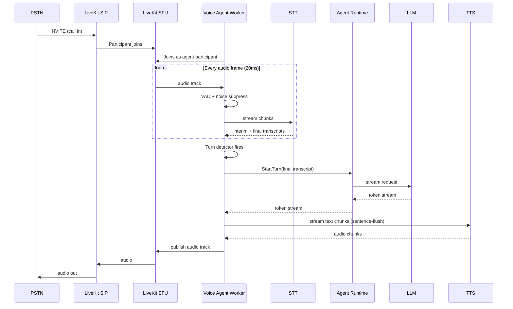

# VOICE PIPELINE

## 1. Objectives

- **Sub-second turn latency** (p50 < 700 ms end-to-end).
- **Barge-in** support (< 200 ms detection).
- **Natural prosody** with per-tenant voice cloning option.
- **Bidirectional streaming** with jitter buffering.
- **Provider portability** — swap STT/TTS/LLM without app changes.
- **Cost efficiency** — < $0.05/min blended target at scale.

## 2. Component Choices

| Layer | Primary | Alternates | Rationale |
|-------|---------|-----------|-----------|
| Media transport | **LiveKit** (WebRTC) + **LiveKit SIP** | Daily, mediasoup, Twilio Voice, FreeSWITCH | Open source, scalable SFU, telephony bridge, Python agents SDK |
| VAD | **Silero VAD** (small, on-node) | WebRTC VAD, Picovoice Cobra | Low latency, GPU-optional |
| STT (streaming) | **Deepgram Nova-3** | AssemblyAI Universal-Streaming, Speechmatics, Whisper-large-v3 (self-host), Azure Speech | Best latency + accuracy; multilingual |
| Turn detection | **Semantic turn detector** (custom small model) + heuristic | LiveKit's turn detector | Reduce false interruptions |
| LLM | Via **LLM Router** (LiteLLM) → GPT-4o-mini, Claude Haiku, Llama-3.3 (Groq) | — | Streaming + function calling; tenant policy chooses |
| TTS (streaming) | **ElevenLabs Turbo v2.5** | Cartesia Sonic, Rime, Azure Neural, OpenAI TTS, XTTS-v2 (self-host) | ~200 ms TTFB, cloning |
| Orchestration | **Pipecat** (voice pipeline) + **LiveKit Agents** | Bland/Vapi (SaaS, rejected — lock-in) | Open source, composable, Python |
| Telephony | **Twilio Elastic SIP** + **Telnyx** + **Plivo** | AWS Chime SDK Voice, Vonage | Multi-provider for reliability + coverage |

## 3. High-Level Flow

## 4. Latency Budget (p50 target = 700 ms)

| Stage | Budget (ms) | Notes |
|-------|------------|-------|
| Network in (last-hop) | 40 | Depends on carrier |
| Jitter buffer | 40 | Adaptive 20–80 ms |
| VAD end-of-utterance | 120 | Semantic turn model shaves 100 ms vs. pure VAD |
| STT finalize | 100 | Deepgram Nova streaming |
| Prompt compose + LLM TTFT | 250 | Prefix cache, small model, low reasoning |
| TTS TTFB | 130 | ElevenLabs Turbo / Cartesia |
| Network out | 20 | |
| **Total** | **700** | |

For chat: relaxed to 1–1.5 s p50.

## 5. Audio Format

- **Opus 20 ms frames** in LiveKit; **G.711 μ/A** over SIP → Opus transcoded at gateway.
- **48 kHz** internal; downsample per provider requirement (Deepgram 16 kHz PCM).
- Noise suppression: **RNNoise** or provider-side (Deepgram has built-in).
- Echo cancellation: WebRTC AEC on WebRTC clients; not needed on SIP (carrier).

## 6. Turn Detection

Heuristic + semantic:
- End-of-speech silence threshold (adaptive: 400 ms in question, 700 ms in narration).
- **Semantic turn detector**: small transformer trained to predict "utterance complete" from transcript prefix (deployed as ONNX in the worker).
- Fallback: hard 1200 ms silence.

Reduces false turn ends (mid-thought pauses) by ~40% based on prior art (LiveKit blog).

## 7. Interruption / Barge-In

- While TTS playing, VAD monitors user energy.
- On sustained speech > 300 ms above threshold:
  - Cancel TTS producer immediately.
  - Cancel LLM stream (`abort()` on provider client).
  - Stop audio publish; play brief attenuation.
  - New STT segment begins; runtime rolls back to pre-response state.
- Backchannel words ("uh-huh", "okay") are ignored via classifier (not treated as barge-in).

## 8. Concurrency & Resource Model

- Each active call = **1 voice worker** (Python coroutine set inside a `voice-agent` pod).
- One pod handles ~50 concurrent calls (measured on 4 vCPU/8 GB, VAD on CPU).
- GPU only if using self-hosted TTS/STT.
- Horizontal scale via HPA on `active_calls` custom metric.
- Warm pool of pre-provisioned workers to avoid cold-start voice glitches.

## 9. Telephony (Inbound + Outbound)

- **Multi-provider trunking** for redundancy: Twilio (primary) + Telnyx (secondary) + Plivo (tertiary).
- Number provisioning API abstracts providers.
- Emergency call handling per E911/Kari's Law (US) — required for compliance.
- **Outbound compliance**: TCPA (US), DNC scrubbing, call recording consent prompts by jurisdiction.
- **STIR/SHAKEN** attestation to avoid spam labeling.

## 10. Voice Cloning & Custom Voices

- ElevenLabs voice library + custom cloning (Enterprise: on-prem via XTTS-v2 or Coqui).
- Voice consent policy enforced (upload requires attestation).
- Per-tenant voice inventory; per-agent voice binding.

## 11. Recording & Compliance

- Optional recording per tenant + per call.
- Consent prompt injected as first agent utterance where required (jurisdiction-detected).
- Recordings encrypted with tenant CMK; stored in S3 WORM bucket for regulated tenants.
- **Automatic PII redaction** on transcript + audio (bleep) via post-processing.

## 12. Fallbacks & Degradation

- STT provider down → auto-failover to secondary (Deepgram → AssemblyAI).
- TTS provider down → cached voice-alt or synthesized notice + failover.
- LLM provider degraded → LiteLLM circuit breaker → fallback chain.
- Complete AI failure → play holding message + queue for human (with reason logged).

## 13. Observability

- Per-turn spans include: `stt_ms`, `llm_ttft_ms`, `llm_total_ms`, `tts_ttfb_ms`, `total_ms`, `barge_ins`, `words_in`, `words_out`.
- MOS (Mean Opinion Score) estimation via ITU-T P.563 (no-reference) sampled on 1% of calls.
- Live "listen in" for supervisors (RBAC-controlled).

## 14. Anti-Patterns Rejected

- ❌ Half-duplex "walkie-talkie" pipelines (kills UX).
- ❌ Non-streaming TTS (adds 500ms+).
- ❌ Cloud-only STT with no on-prem fallback for regulated tenants.
- ❌ Single telephony provider (single point of business risk).
- ❌ Sending full call audio through app tier (bandwidth + PII risk).

## 15. Assumptions
- Pipecat + LiveKit combo will remain best-of-breed OSS voice stack.
- Native voice models (GPT-4o Realtime, Gemini Live) will co-exist as *alternative* pipelines chosen per agent — not a full replacement (worse observability, tool control, and cost).
- On-prem regulated deploys will use Whisper (self-host) + XTTS-v2 + open LLM (Llama-3.3-70B on vLLM).
